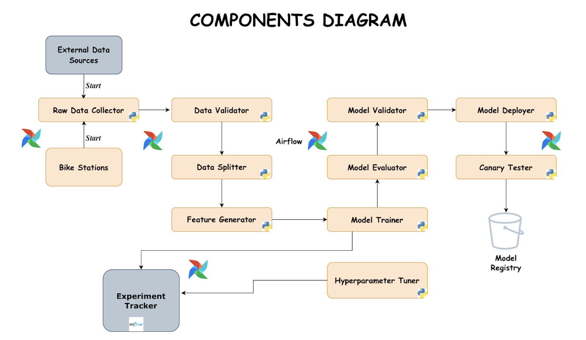

# Bike-Rental-Prediction

This project optimizes a city-wide bike-sharing platform's dynamic pricing. It uses a machine learning model to forecast hourly bike rental demand and a real-time algorithm to adjust prices. The goal is to maximize revenue during peak times and stimulate demand during slow periods.

## Table of Contents
<!-- TOC -->

- [Bike-Rental-Prediction](#bike-rental-prediction)
  - [Table of Contents](#table-of-contents)
  - [Architecture Diagram](#architecture-diagram)
  - [Quick Start](#quick-start)
    - [Option 1: Automated Setup Recommended](#option-1-automated-setup-recommended)
    - [Option 2: Manual Setup](#option-2-manual-setup)
      - [Step 1: Install UV](#step-1-install-uv)
      - [Step 2: Setup development environment](#step-2-setup-development-environment)
      - [Step 3: Configure environment](#step-3-configure-environment)
      - [Step 4: Start services](#step-4-start-services)
      - [Step 5: Initialize database](#step-5-initialize-database)
      - [Step 6: View available commands](#step-6-view-available-commands)
  - [Problem Statement](#problem-statement)
  - [Objectives](#objectives)
  - [Future Enhancements](#future-enhancements)

<!-- /TOC -->

## Architecture Diagram

The architecture diagram shows the detailed interactions and dependencies between internal modules.



For more details, see the [System Architecture Documentation](docs/ARCHITECTURE.md).

## Quick Start

### Option 1: Automated Setup (Recommended)

```sh
# Complete setup in one command
make quickstart
```

This will:

1. Set up development environment
2. Start Docker services
3. Initialize database with migrations and seed data
4. Show you all running services

### Option 2: Manual Setup

#### Step 1: Install UV

[UV Installation Guide](https://docs.astral.sh/uv/getting-started/installation/#__tabbed_1_1)

#### Step 2: Setup development environment

```sh
make dev-setup
# or manually:
uv sync
```

#### Step 3: Configure environment

```sh
cp .env.example .env
# Edit .env with your settings
```

#### Step 4: Start services

```sh
make compose-up
```

#### Step 5: Initialize database

```sh
make db-init
```

#### Step 6: View available commands

```sh
make help
```

## Problem Statement

A bike-sharing platform operating across an entire city wants to optimize its dynamic pricing system.
To do so, it must accurately forecast the total number of bike rentals expected in the next hour city-wide.

These forecasts will drive real-time pricing adjustments to:

- Maximize revenue during surges
- Stimulate demand during slow periods

## Objectives

Develop a real-time machine learning model that forecasts hourly bike rental demand across the city, enabling:

- Accurate hourly demand predictions
- Real-time pricing adjustments
- Pipeline automation for continuous model updates using Apache Airflow

## Future Enhancements

- Automate model retraining based on performance metrics.
- Enhance dashboard with interactive visualizations.
- Integrate Apache Kafka for real-time data streaming.
- Implement advanced A/B testing for pricing strategies.
