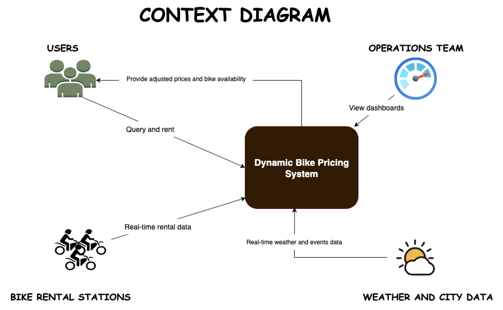
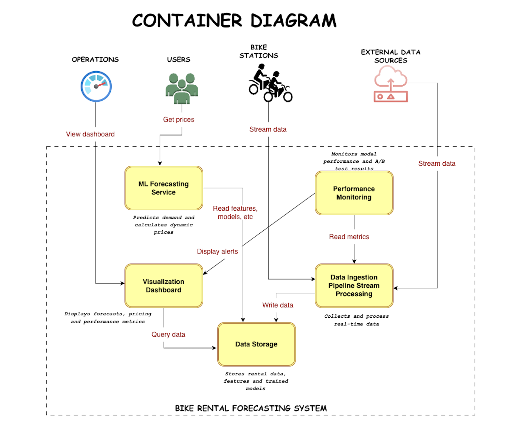

# System Architecture

## Table of Contents
<!-- TOC -->

- [System Architecture](#system-architecture)
  - [Table of Contents](#table-of-contents)
  - [Overview](#overview)
  - [Context Diagram](#context-diagram)
    - [Key Interactions](#key-interactions)
  - [Container Architecture](#container-architecture)
  - [Components Diagram](#components-diagram)
  - [Data Flow](#data-flow)
    - [Training Pipeline](#training-pipeline)
    - [Inference Pipeline](#inference-pipeline)
  - [Technology Stack](#technology-stack)
  - [Infrastructure](#infrastructure)
    - [Containerized Services](#containerized-services)
    - [Deployment Options](#deployment-options)
  - [Security Features](#security-features)
  - [Monitoring & Logging](#monitoring--logging)
  - [Development Workflow](#development-workflow)
  - [Key Design Principles](#key-design-principles)
  - [Future Enhancements](#future-enhancements)

<!-- /TOC -->
## Overview

The Bike-Rental-Prediction system is a comprehensive machine learning platform designed to forecast hourly bike rental demand and optimize dynamic pricing for a city-wide bike-sharing platform. The architecture is built on a modern, containerized stack with clear separation of concerns across multiple layers.

## Context Diagram

The context diagram shows how the system interacts with external entities and end-users.



### Key Interactions

- **Users/Administrators**: Access the system through REST APIs and web dashboards
- **Bike-Sharing Platform**: Provides real-time rental data and receives pricing recommendations
- **Data Sources**: External weather, holiday, and historical data feeds
- **Analytics & Monitoring**: Tracks system performance and model metrics

## Container Architecture

The container diagram illustrates the internal structure and communication between components. It shows major deployable components.



## Components Diagram

The components diagram shows the detailed interactions and dependencies between internal modules.


## Data Flow

### Training Pipeline

```text
Data Ingestion
  ↓
Data Validation
  ↓
Feature Engineering
  ↓
Model Training (with Hyperparameter Optimization)
  ↓
Model Evaluation
  ↓
Artifact Storage (MLflow + S3)
  ↓
Model Registry
```

### Inference Pipeline

```text
Real-time Rental Data
  ↓
Feature Engineering
  ↓
Load Model from Registry
  ↓
Generate Prediction
  ↓
Dynamic Pricing Adjustment
  ↓
API Response / Dashboard Update
```

## Technology Stack

| Layer | Technology |
|-------|-----------|
| **API Framework** | FastAPI |
| **Web Server** | Uvicorn |
| **Database** | PostgreSQL |
| **ORM** | SQLAlchemy |
| **ML Frameworks** | LightGBM, XGBoost, Scikit-learn |
| **Hyperparameter Tuning** | Optuna |
| **Experiment Tracking** | MLflow |
| **Orchestration** | Apache Airflow |
| **Containerization** | Docker, Docker Compose |
| **Cloud Storage** | AWS S3 |
| **Authentication** | JWT + Bcrypt |
| **Data Processing** | Pandas, Polars, NumPy |
| **Monitoring** | Logging, Metrics |

## Infrastructure

### Containerized Services

- **Custom Airflow**: DAG orchestration with CeleryExecutor
- **Custom MLflow**: Experiment tracking and model registry
- **PostgreSQL**: Persistent data storage
- **Redis**: Task queue and caching
- **API Service**: FastAPI application
- **Jupyter**: Interactive development environment

### Deployment Options

- **Local Development**: Docker Compose with all services
- **Cloud Deployment**: Scalable deployment with persistent storage
- **Database Migrations**: Alembic for schema versioning

## Security Features

- **Authentication**: JWT-based API authentication
- **Authorization**: Role-based access control
- **Password Security**: Bcrypt hashing
- **Environment Variables**: Secure credential management
- **Secret Management**: Configured via `.env` files

## Monitoring & Logging

- **Experiment Tracking**: Comprehensive model metrics via MLflow
- **System Logs**: Airflow task execution logs
- **Performance Metrics**: Model accuracy, precision, recall
- **API Monitoring**: Request/response logging
- **Data Quality**: Validation and anomaly detection

## Development Workflow

1. **Setup**: Automated setup with `make quickstart`
2. **Development**: Python development environment with UV
3. **Testing**: Jupyter notebooks for experimentation
4. **Version Control**: Alembic for database versioning
5. **Deployment**: Docker-based containerized deployment
6. **Monitoring**: MLflow for experiment tracking

## Key Design Principles

- **Modularity**: Clear separation of concerns across layers
- **Scalability**: Containerized architecture for horizontal scaling
- **Reproducibility**: Version-controlled models and experiments
- **Maintainability**: Well-documented code with type hints
- **Reliability**: Comprehensive error handling and validation
- **Observability**: Extensive logging and monitoring capabilities

## Future Enhancements

- Real-time feature store for low-latency serving
- Real-time data streaming and processing using Apache Kafka
- Advanced A/B testing framework for pricing strategies
- Automated model retraining triggers
- Enhanced dashboard with interactive visualizations
- Kubernetes deployment configurations
- Distributed training for large-scale datasets
